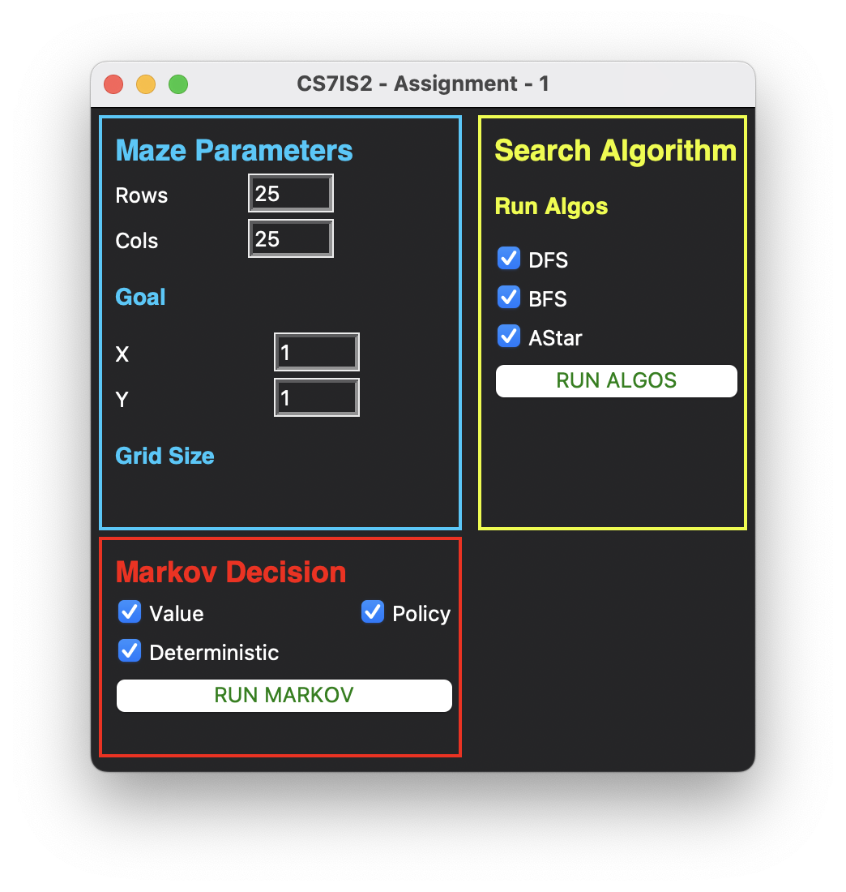

# Search and MDPs

For the purpose of this assignment I have used the open source [github](https://github.com/MAN1986/pyamaze) repository `pyamaze`

## Commands
1. To run the code simply run the main.py file
```
python main.py
```

The code will display a _GUI_ where parameters can be changed such as:
1. Grid Size
2. Goal Location
3. The algorithms to run together



