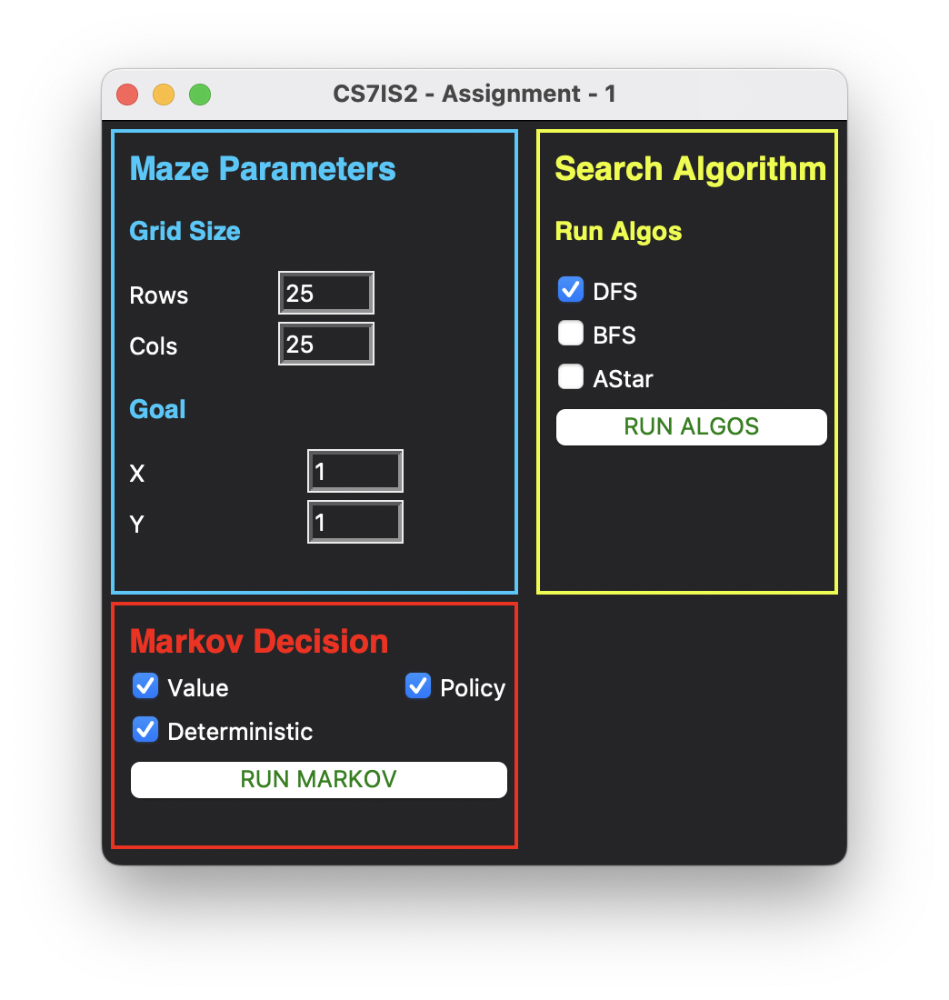
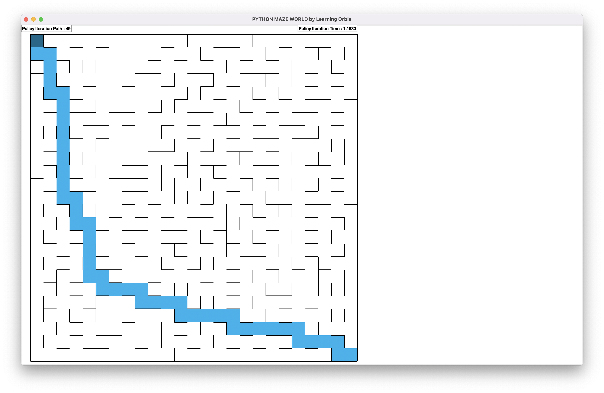

# Search and MDPs

For the purpose of this assignment I have used the open source [github](https://github.com/MAN1986/pyamaze) repository `pyamaze`. The demonstration for running the code can be found [here](https://youtu.be/BCsvA1Ct6gw)

<p align='center'>
  <a href="http://www.youtube.com/watch?feature=player_embedded&v=BCsvA1Ct6gw" target="_blank">
      
  </a>
<p>

  
## Documentation
```
https://github.com/hamzzgab/Artificial-Intelligence.git # CLONE
cd Assignment-1                                        # MAIN FOLDER
pip install -r requirements.txt                        # INSTALL
```

If the requirements.txt doesn't work the `pyamaze` library can be simply installed by using
```
pip install pyamaze
```

### Commands
1. To run the code simply run the main.py file
```
python main.py
```

The code will display a _GUI_ where parameters can be changed such as:
1. Grid Size
2. Goal Location
3. The algorithms to run together

<div align="center">

</div>

### Defaults
Grid:
1. `Rows - 25`
2. `Cols - 25`
3. `Goal - (1, 1)` (Top Left) 

Search Algorithm:
The selected algorithms will run together
1. `DFS - Selected`
2. `BFS - Selected`
3. `AStar - Selected`

Markov Decision Process:
The selected algorithms will run together
1. `Value Iteration - Selected`
2. `Policy Iteration - Selected`

## Search Algorithms

To run the select the checkboxes from the Search Algorithm section and click on the Run Algos button. It will run the selected algorithm using the rows, cols as the grid size and the reach to the specified goal.
- Select any algorithm from the checkboxes
- Click on `RUN ALGOS`
- The code will open a new window on which the search algorithm will run
<div align="center">

</div>

#### Analysis Parameters
To compare the 3 algorithms I have used 3 metrics, displayed on top of the maze
1. Final Path
2. Searched Path
3. Time Taken

### 1. Depth First Search
<div align="center">

</div>

### 2. Breadth First Search
<div align="center">

</div>

### 3. AStar
<div align="center">

</div>

## Search Algorithms Running Together
<div align="center">

</div>


## Markov Decision Process
To run the select the checkboxes from the Search Algorithm section and click on the Run Markov button. It will run the selected algorithm using the rows, cols as the grid size and the reach to the specified goal.
- Select any algorithm from the checkboxes
- Click on `RUN MARKOV`
- The code will open a new window on which the search algorithm will run
<div align="center">

</div>

#### Analysis Parameters
To compare the 2 algorithms I have used 2 metrics, displayed on top of the maze
1. Final Path 
2. Time Taken

### 1. Value Iteration
<div align="center">

</div>


### 2. Policy Iteration
<div align="center">

</div>

## MDP Algorithms Running Together
<div align="center">

</div>
