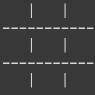
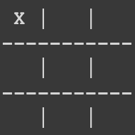
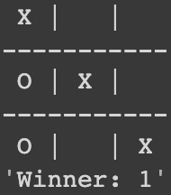
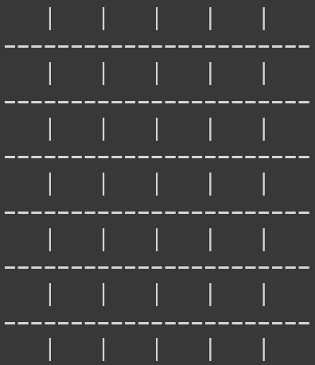
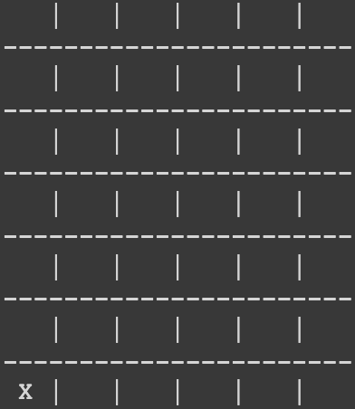
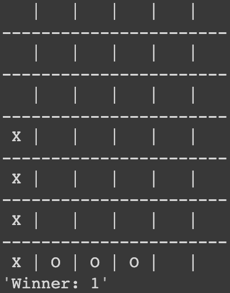

# Minimax and RL

For the purpose of this assignment I have used the open source [library](https://pypi.org/project/python-tictactoe/). The demonstration for running the code can be found [here]()

## Documentation

| Action      | Command                                                  |
|-------------|----------------------------------------------------------|
| Clone       | `https://github.com/hamzzgab/Artificial-Intelligence.git` |
| Main Folder | `cd Assignment-2`                                        |
| Main Folder | `pip install -r requirements.txt`                                        |

If the requirements.txt doesn't work the `python-tictactoe` library can be simply installed by using
```
pip install python-tictactoe
```

### Commands
1. To run the code simply cd into the game folder for TicTacToe and Connect4 from the Assignment-2 folder
2. It will display the game playing in the command line, the code for this project is not gamified.

#### TicTacToe
```
cd TicTacToe
python main.py
```
<p float="left">



</p>

#### Connect4
```
cd Connect4
python main.py
```

<p float="left">



</p>


### Defaults
#### TicTacToe
| Property | Value |
|----------|-------|
| `ROWS`   | 3     |
| `COLS`   | 3     |

#### Connect4
| Property | Value |
|----------|-------|
| `ROWS`   | 6     |
| `COLS`   | 7     |

## Algorithms
Initialize the game using `TicTacToe(p1, p2)` or `ConnectFourBoar(p1, p2)`, where `p1` and `p2` are the 
player(algorithms) objects.

### TicTacToe Players
`HumanPlayer('human')`
`RandomPlayer('random')`
`DefaultPlayer('default')`
`MinimaxPlayer('minimax')`
`QLearningPlayer('q-agent')`

**Example:**
```
p1 = DefaultPlayer('default')
p2 = MinimaxPlayer('Q2')
game = TicTacToe(p1, p2)
game.play()
```

### Connect4 Players
`HumanPlayer('human')`
`RandomPlayer('random')`
`MinimaxPlayer('minimax')`
`QLearningPlayer('q-agent')`

**Example:**
```
ConnectFour.ROWS = 6
ConnectFour.COLS = 7

p1 = RandomPlayer('random')
p2 = MinimaxPlayer('minimax')
game = ConnectFourBoard(p1, p2)
game.play()
```

### Q-Learning
#### Training

1. Initialize two `QLearningPlayer('player-1')` players with a different name
2. Initialize a game object for `TicTacToe(p1, p2)` or `ConnectFourBoard(p1, p2)` depending on which board you want to train
   1. Pass the Player-1 and Player-2 objects
3. Use the game objects `train(iterations=500)` function and pass the number of iterations to be trained for
   1. Save the Policy for the QLearningPlayer from the object created
**Example:**
```
ConnectFour.ROWS = 6
ConnectFour.COLS = 7

p1 = QLearningPlayer('Q1-6x7')
p2 = QLearningPlayer('Q2-6x7')

game = ConnectFourBoard(p1, p2)
game.train(500000)

p1.savePolicy()
p2.savePolicy()
```

#### Loading Trained Agent
1. Initialize the `QLearningPlayer('player-1')` 
2. Use the object to load the policy with the name of the pickle file
   1. p1.loadPolicy('policy_QLearning-1') 
3. Initialize a game object from `TicTacToe(p1, p2)` or `ConnectFourBoard(p1, p2)`
   1. Pass the Player-1 and Player-2 objects
4. Use the `game.play()` function to play the game

**Example:**
```
ConnectFour.ROWS = 6
ConnectFour.COLS = 7

p1 = QLearningPlayer('Q1-6x7')
p1.loadPolicy('policy_Q1-6x7')

p2 = MinimaxPlayer('minimax')

game = ConnectFourBoard(p1, p2)
game.play
```